# 김민재
###### 202530204 


#### 10/31 보강 
## 6-3 단순선택 정렬
**단순 선택 정렬 알아보기 - (1)**
* 단순 선택 정렬straight selection sort
    * 아직 정렬하지 않은 부분에서 값이 가장 작은 요소를 선택하고 아직 정렬하지 않은 부분의 첫 번째 요소와 교환 
* 교환 과정 
    * 1. 아직 정렬하지 않은 부분에서 가장 작은 키의 값(a[min])을 선택
    * 2. (a[min])과 아직 정렬하지 않은 부분의 첫 번째 요소를 교환

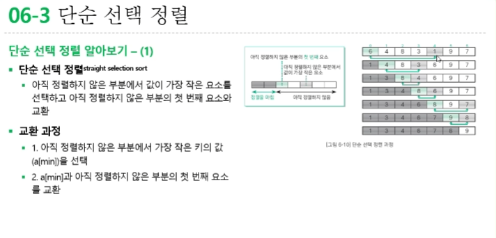

**단순 선택 정렬 알아보기 - (2)**
* 실습 6-4
    * 단순 선택 정렬을 수행하는 함수
    * 단순 선택 정렬 알고리즘의 요솟값을 비교하는 횟수는 (n제곱-n) / 2회
    * 이 정렬 알고리즘은 서로 떨어져 있는 요소를 교환하는 것이기 때문에 안정적이지 않음

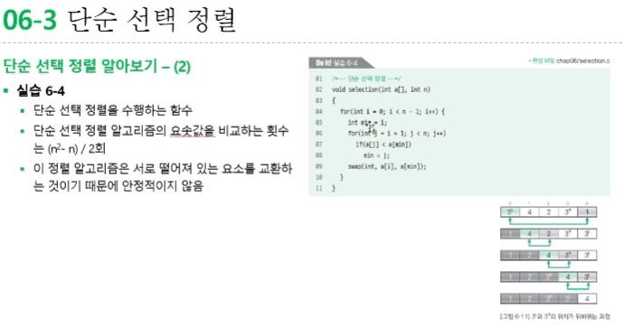

## 6-4 단순 삽입 정렬
** 단순 삽입 정렬 알아보기 - (3)
* 단순 삽입 정렬straight insertion sort
    * 선택한 요소를 그보다 더 앞쪽의 알맞은 위치에 '삽입하는' 작업을 반복하여 정렬하는 알고리즘
    * 아직 정렬되지 않은 부분의 첫 번째 요소를 정렬된 부분의 알맞은 위치에 삽입
    * 아래의 두 조건 중 하나를 만족할 때까지 j를 1씩 감소하면서 대입하는 작업을 반복
        * 1. 정렬된 열의 왼쪽 끝에 도달
        * 2. tmp보다 작거나 같은 key를 갖는 항목 a[j-1]을 발견
    * 드모르간 법칙 적용을 적용해 아래의 두 조건이 모두 성립할 때까지 반복
        * 1. j가 0보다 큼
        * 2. a[j-1] 값이 tmp보다 큼

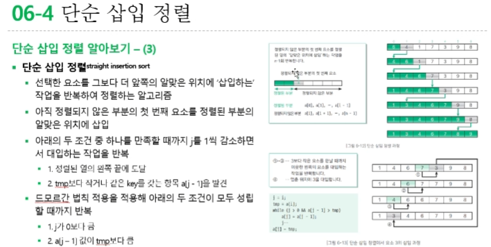

## 6-5 셸 정렬
**단순 삽입 정렬의 특징 이해하기**
* 단순 삽입 정렬의 특징
    * 정렬을 마쳤거나 정렬을 마친 상태에 가까우면 정렬 속도가 매우 빨라짐(장점)
    * 삽입할 위치가 멀리 떨어져 있으면 이동(대입)해야 하는 횟수가 많아짐(단점)

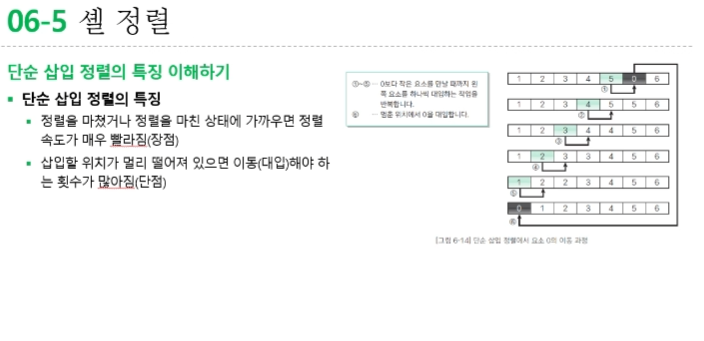

**셸 정렬 살펴보기 - (1)**
* 셸 정렬shell sort
    * 단순 삽입 정렬의 장점은 살리고 단점은 보완한 정렬 알고리즘
    * 정렬할 배열의 요소를 그룹으로 나눠 각 그룹별로 단순 삽입 정렬을 수행
    * 그 그룹을 합치면서 정렬을 반복하여 요소의 이동 횟수를 줄이는 방법
* 4-정렬
    * 4칸만큼 떨어진 요소를 모아 그룹을 4개로 나누어 정렬하는 방법
    * 아직 정렬을 마친 상태는 아니지만 정렬을 마친 상태에 가까워짐

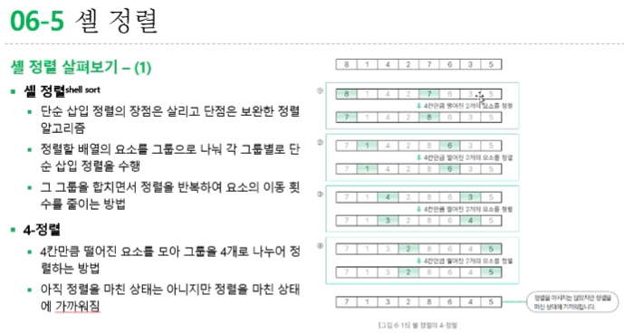

**셸 정렬 살펴보기 - (2)**
* 2-정렬
    * 2칸만큼 떨어진 요소들을 모아 두 그룹({7,3,8,4}, {1,2,6,5})으로 나누어 '2-정렬'을 함
    * 정렬을 마치고 나면 각각의 그룹은 {3,4,7,8}, {1,2,5,6}으로 정렬 됨
* h-정렬
    * 셸 정렬 과정에서 수행하는 각각의 정렬
        * 1. 2개 요소에 대해 '4-정렬'(4개의 그룹)
        * 2. 4개 요소에 대해 '2-정렬'(2개의 그룹)
        * 3. 8개 요소에 대해 '1-정렬'(1개의 그룹)
    
    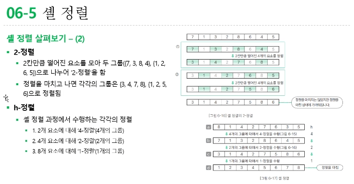

**셸 정렬 살펴보기 - (4)**
* 증분값(h값)의 선택
    * h값은 n부터 감소하여 마지막에 1이 되면 됨
    * 그림 6-18의 서로 다른 색으로 표현한 이들 두 그룹은 서로 섞이지 않음
    * 이렇게 그룹이 섞이지 않으면 c를 합쳤을 때 다시 처음 단계인 a와 동일한 상태가 됨
    * 그러면 다시 a의 학생을 정렬하는 것과 같아서 기껏 그룹을 나누었음에도 정렬 알고리즘이 충분히 작동하지 않음
    * h값이 서로 배수가 되지 않도록 해야 요소가 충분히 섞여 효율적인 정렬을 기대할 수 있음
    * 아래 수열을 거꾸로 살펴보면 1부터 시작하여 3배한 값에 1을 더하는 수열 
        * h = ..., -> 121 -> 40 -> 13 -> 4 -> 1

    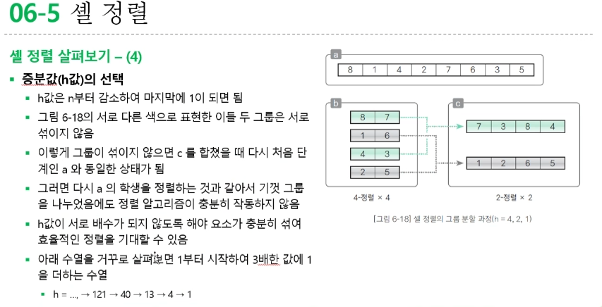

## 6-6 퀵 정렬
**퀵 정렬 살펴보기**
* 퀵 정렬quick sort
    * 일반적으로 사용되고 있는 아주 빠른 정렬 알고리즘
    * 그림 6-19는 이 알고리즘으로 학생 수가 8명인 그룹을 키 순서대로 정렬한 모습을 나타낸 것
    * 먼저 어느 한 사람의 키를 선택
    * 키가 168cm인 학생 A를 선택할 경우 그 학생을 기준으로 학생 A의 키보다 작은 사람의 그룹과 큰 사람의 그룹으로 나눔
    * 이때 이 학생 A의 키를(그룹을 나누는 기준) 피벗(pivot)이라고 함
    * 퀵 정렬은 각 그룹에 대해 피벗 설정과 그룹 나눔을 반복하며 모든 그룹이 1명이 되면 정렬을 마침

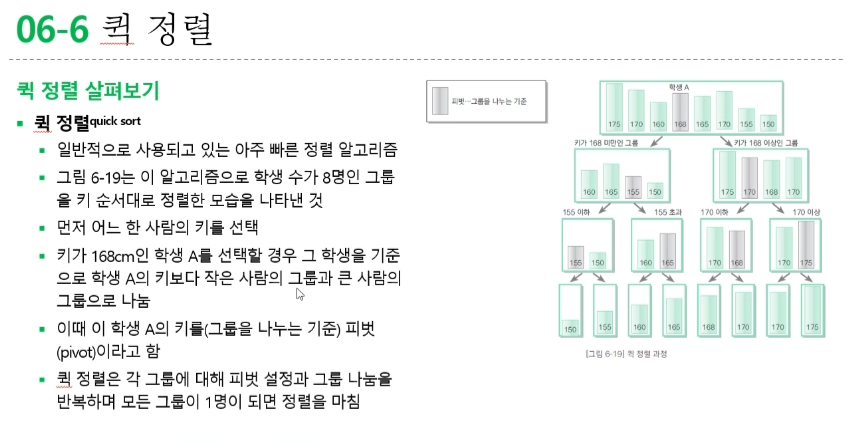

**배열을 두 그룹으로 나누기 - (1)**
* 배열을 두 그룹으로 나누기
    * 그룹을 나누려면 피벗 이하의 요소를 배열 왼쪽으로, 이상의 요소를 배열 오른쪽으로 옮겨야 함
        * 1. a[pl] >=x가 성립하는 요소를 찾을 때까지 pl을 오른쪽으로 옮김
        * 2. a[pr] <=x가 성립하는 요소를 찾을 때까지 pr을 왼쪽으로 옮김
    * pl이 위치한 지점은 피벗값 이상의 요소가 있는 지점이고 pr이 위치한 지점은 피벗 값 이하의 요소가 있는 지점
    * pl과 pr이 교차하면 그룹을 나누는 과정이 끝나고 배열은 아래처럼 두 그룹으로 나누어짐
        * 피벗 이하의 그룹: a[0], ..., a[pl-1]
        * 피벗 이상의 그룹: a[pr+1], ..., a[n-1]

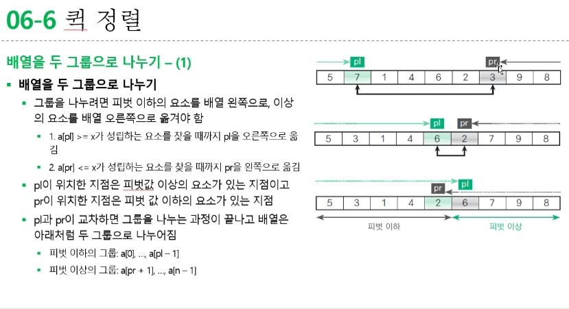

**배열을 두 그룹으로 나누기 - (2)**
* 피벗과 같은 값을 가지는 그룹
    * 그룹을 나누는 작업이 끝난 다음 pl > pr + 1인 경우에는 다음과 같은 그룹이 생길 수 있음
        * 피벗과 일치하는 값을 가지는 그룹: a[pr+1], ..., a[pl-1]
    * b,c,d 왼쪽 커서, 오른쪽 커서가 피벗 이상, 피벗 이하의 요소를 찾아 멈춘 단계 
    * d pl, pr이 동일한 요소 a[4] 위에 있음
    * 이때 동일한 요소인 a[4]와 a[4]를 교환
    * 동일한 요소를 교환하는 시도가 의미 없어 보이지만 이 시도는 아무리 많아야 1회이므로 해도 괜찮음
    * e 계속 스캔하면 pl, pr이 교차하면서 그룹을 나누는 과정을 마침

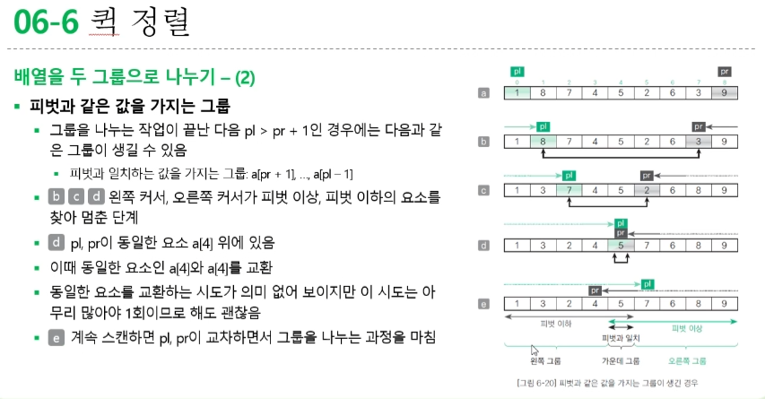


#### 10/30 강의

## 4-1 스택이란?
**스택stack**
* 데이터를 일시적으로 저장하기 위해 사용하는 자료구조 
* 데이터의 입력과 출력 순서는 후입선출
    * 즉, 가장 나중에 넣은 데이터를 가장 먼저 꺼냄
* 푸시(push) : 스택에 데이터를 넣는 작업
* 팝 : 스택에서 데이터를 꺼내는 작업
* 꼭대기(top) : 푸시, 팝을 하는 위치
테이블에 겹겹이 쌓은 접시처럼 데이터를 넣는 작업도 꺼내는 작업도 위쪽부터 수행 
* 바닥(bottom) : 스택의 가장 밑바닥 부분

**스택의 구현 예**
* 함수를 호출하고 실행할 떄 프로그램 내부에서는 스택을 사용
* 가장 먼저 main 함수를 실행하며 main 함수는 z 함수를 호출 
* 호출된 함수 z는 x 함수와 y함수를 순서대로 호출
* 함수를 호출할때는 푸시하고 함수가 실행을 종료하고 호출한 원래의 함수로 돌아갈 때는 종료할 함수를 팝함 
* main -> z -> x의 순서대로 함수를 호출
    * 이떄 스택의 상태는 호출한 함수의 역순으로 겹겹이 쌓여있어 함수 호출이 계층 구조로 이루어져 있음
    * 이 상태에서 x 함수의 실행이 종료되면 x 함수만 팝함

**스택 구조체 IntStack**
* 스택으로 사용할 배열을 가리키는 포인터 stk
    * 인덱스가 o인 요소를 스택의 바닥(bottom)이라 함
    * 배열의 메모리 공간 할당은 Initialize 함수로 생성
* 스택의 최대 용량 max
    * 배열 stk의 요소 개수와 같음
* 스택 포인터 ptr
    * 스택에 쌓여있는 데이터의 개수를 나타냄
    * 스택이 비어 있으면 ptr의 값은 0이고 가득 차있으면 max

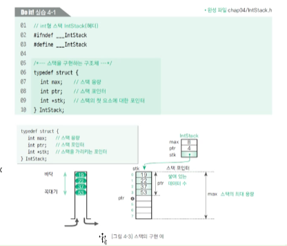

**스택 만들기 - (2)**
* 실습 4-1
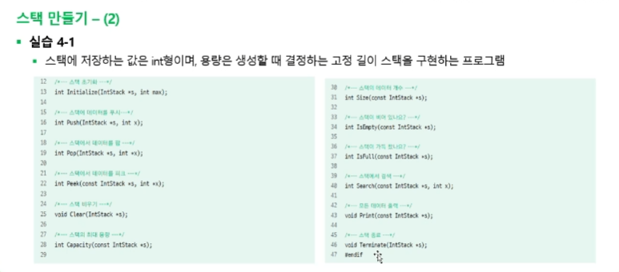

**스택만들기 - (3)**
* 초기화 함수 Initialize
    * 스택의 메모리 공간(배열)을 확보하는 등의 준비 작업을 수행하는 함수 
    * 1 배열을 위한 메모리 공간을 만들 떄 스택은 비어있어야(데이터가 하나도 쌓여 있지 않은 상태여야) 하므로 스택 포인터 ptr 값은 0으로 함
    * 2 요소의 개수가 max인 배열 stk를 생성함. 이때, 스택의 개별 요소에 접근하는 인덱스 식은 바닥(bottom)부터 stk[0], stk[1], ..., stk[max - 1]이 됨
    * 3 매개변수 max로 받은 값을 스택 최대 용령을 나타내는 구조체의 멤버 max에 저장

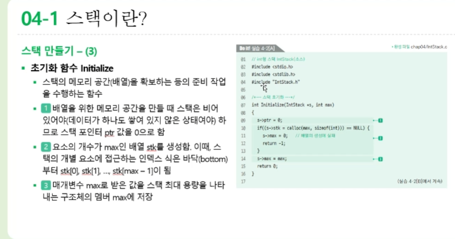

## 4-2 큐란?
**큐queue**
* 데이터를 일시적으로 쌓아두기 위한 자료구조
* 가장 먼저 넣은 데이터를 가장 먼저 꺼내는 선입선출 구조를 이룸
* 은행 창구에서 차례를 기다리는 대기열이나 마트에서 계산을 기다리는 대기열과 같음
* 인큐(en-queue): 큐에 데이터를 넣는 작업 
* 디큐(de-queue): 데이터를 꺼내는 작업
* 프런트(front): 데이터를 꺼내는 쪽
* 리어(rear): 데이터를 넣는 쪽

**배열로 큐 만들기**
* 큐의 구현 예
    * a 배열의 프런트(front)부터 4개(19, 22, 37, 53)의 데이터가 들어가 있는 모습
    * b 24 인큐 
        * 리어(rear)의 데이터가 저장된 que[3]의 다음 요소 que[4]에 24를 저장
        * 이 처리의 복잡도는 O(1) 이고 적은 비용으로 구현할 수 있음

    * c 19 디큐
        * que[0]에 저장된 19를 꺼낸 다음 두 번째 이후의 요소를 모두 맨 앞으로 옮김 
        * 이 처리의 복잡도는 O(n)이며 데이터를 꺼낼 때마다 이런 처리를 하게 되면 효율이 떨어짐

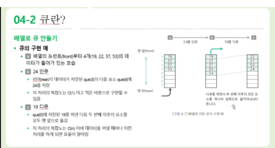

**링 버퍼로 큐 만들기 - (1)**
* 링 버퍼ribg buffer
    * 배열의 처음이 끝과 연결되었다고 보는 자료구조
    * 프런트(front): 논리적인 맨 처음 요소의 인덱스
    * 리어(rear) : 논리적인 맨 끝 요소의 하나 뒤의 인덱스(다음 요소를 인큐할 위치를 미리 지정)
    * 변수 프런틔와 리어의 값은 인큐와 디큐를 수행함에 따라 변화하는데 이 때문에 배열 요소를 앞쪽으로 옮기지 않는 큐를 구현할 수 있음
    * 처리의 복잡도는 O(1)

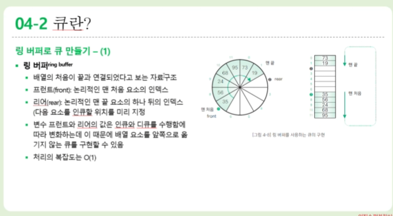

**링 버퍼로 큐 만들기 - (2)**
* 링 버퍼에 대한 인큐와 디큐
    * a 7개의 데이터(35,56,24,68,95,73,19)가 차례대로 que[7] que[8], ..., que[11], que[0], que[1]에 저장
        * 프런트 값은 7이고 리어값은 2
    * b 82를 인큐한 다음의 상태
        * que[2](리어가 가리키고 있는 위치)에 82를 저장한 다음 리어값을 1만큼 증가
    * c 35를 디큐한 다음의 상태
        * 프런트 요소(que[front], 즉 que[7])의 값 35를 빼고 프런트 값을 1만큼 증가
    
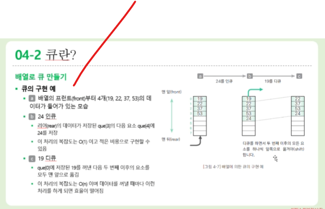

**링 버퍼로 큐 만들기 - (12)**
* 모든 데이터를 출력하는 함수 Print
    * 큐의 모든 데이터를 처음부터 끝까지 순서대로 출력하는 함수
* 종료 함수 Terminate
    * 메모리 공간에 할당한 배열(큐)을 해제하는 함수

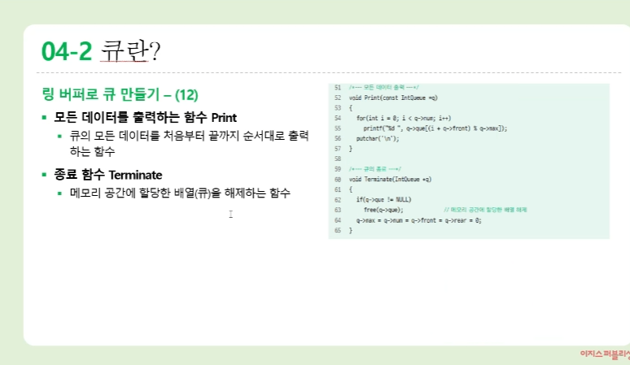

1. Stock 후입 선출(Lifo)
2. Queue 선입 선출(FiFo)
3. 원형 큐(링 버퍼 큐) 
remi front 변수를 수정


# 6장 정렬 알고리즘
## 6-1 정렬

**정렬 정의하기**
* 정렬sorting
    * 이름, 학번, 키 등 핵심 항목(key)의 대소 관계에 따라 데이터 집합을 일정한 순서로 줄지어 늘어서도록 바꾸는 작업
    * 키값이 작은 데이터를 앞쪽에 놓으면 오름차순(ascending order) 정렬, 그 반대로 놓으면 내림차순(descencing order) 정렬이라고 부름
* 정렬 알고리즘의 안정성
    * 안정된 정렬이란 같은 값의 키를 가진 요소의 순사가 정렬 전후에도 유지되는 것
* 정렬 알고리즘의 핵심 요소
    * 교환, 선택, 삽입

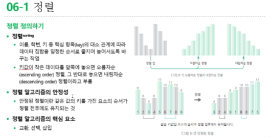

## 6-2 버블 정렬

**버블 정렬 알아보기 - (1)**
* 패스pass
    * 이웃한 요소를 비교하고 교환하는 작업을 첫 번째 요소까지 계속하면 그림 6-3과 같은 상태가 됨
    * 요소의 개수가 n개인 배열에서 n -1 회 비교, 교환을 하고 나면 가장 작은 요소가 맨 처음으로 이동함
    * 이런 일련의 과정(비교, 교환 작업)을 패스(pass)라고 함

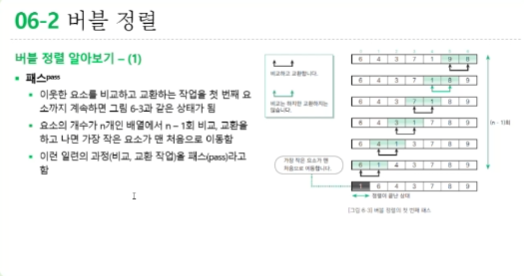

**버블 정렬 알아보기 - (2)**
* 패스 수행 횟수
    * 두 번째 패스의 비교 횟수는 첫 번째 패스보다 1회 적은 n - 2회 
    * 왜냐하면 패스를 1회 수행할 때마다 정렬할 요소가 하나씩 줄어들기 때문
    * 패스를 k회 수행하면 앞쪽의 요소 k개가 정렬
    * 모든 정렬이 끝나려면 n - 1회의 패스가 수행되어야 함

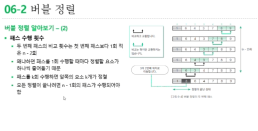

**버블 정렬 알아보기 - (3)**
* 버블 정렬 알고리즘 
    * 비교하는 두 요소의 인덱스를 j - 1과 j라 함
    * 배열의 끝(오른쪽)부터 스캔하기 떄문에 j의 시작값은 n - 1
    * 한 번의 패스에서는 j값이 i + 1이 될 때까지 비교, 교환을 수행하면 됨
    * 비교 횟수는 첫 번째 패스는 n - 1회, 두 번째 패스는 n - 2회, ... 이므로 n(n-1)/2회 
    * 실제 요소를 교환하는 횟수는 배열의 요솟값에 더 많이 영향을 받기 때문에 교환 횟수의 평균값은 비교 횟수의 절반인 n(n-1)/4회
    * 또한 swap 함수 안에서 값의 이동이 3회 발생하므로 이동 횟수의 평균은 3n(n-1)/4회

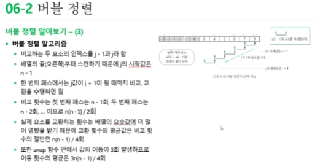

**버블 정렬 알아보기 - (5)**
* 알고리즘 개선 - (1)
    * 이미 배열이 정렬을 마친 상태라면 그 이후의 패스는 요소 교환을 하지 않음
    * 즉, 어떤 패스에서 요소의 교환 횟수가 0이면 더 이상 정렬할 요소가 없다는 뜻이기 때문에 정렬 작업을 멈추면 됨

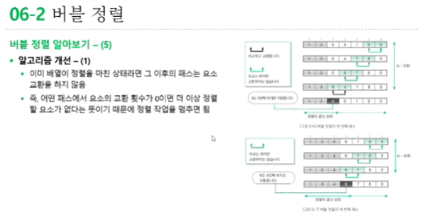

**버블 정렬 알아보기 - (7)**
* 알고리즘 개선 - (2)
    * 마지막 교환(⭐) 이후에 앞쪽의 세 요소((1, 3, 4))는 정렬된 상태
    * 어떤 시점 이후에 교환이 수행되지 않는다면 그보다 앞쪽의 요소는 이미 정렬을 마친 상태라고 생각해도 좋음

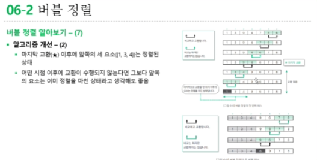

**버블 정렬 알아보기 - (9)**

* 실습 6-3 실행 결과 
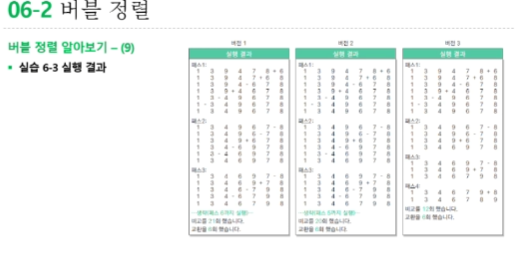


---        
###### 9/11 강의


###### 9/4  강의
[문자 크기](#h1에-해당) / [리스트](#리스트)
# h1에 해당
## h2에 해당
### h3에 해당
#### h4에 해당
##### h5에 해당
###### h6에 해당

*이탤릭 체*
**볼드 체**

---
# 리스트
* 언오더드 리스트
* 언   
    * 탭
        * 탭2번
            * 탭3은 x

1. 오더드 리스트
4. 오더드 리스트

# 코드블럭 
```
int main 
```

인라인 코드블럭 예 : `<br>`, `ctrl` + `A`

외부링크 <br>
[google](https://google.com)

[내부링크](#h1)

[image](./20231027090450_wfludeql.png)